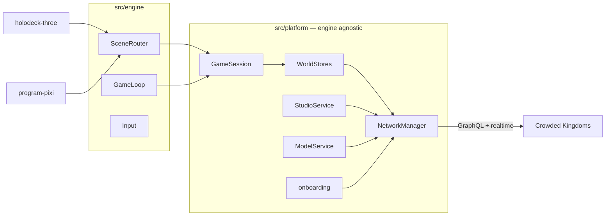

# The Construct

A starter repository for building browser games on [Crowded Kingdoms](https://docs.crowdedkingdoms.com)
with the [CrowdyJS](https://github.com/CrowdedKingdoms/CrowdyJS) SDK.

The SDK gives you the platform. This repo gives you the rest of a game: an
engine-agnostic platform layer, two renderers driven by the same session, a
server-authoritative game model, an in-game Crowdy Studio IDE where players
write and run their own mods, hosted sign-in (your players sign in on Crowded
Kingdoms and come back holding a token for your game -- your page never sees a
password), and a one-command Setup that creates your org and app on Crowded
Kingdoms — no card, no operator, no infra.

Clone it, run it, then replace the demo scenes with your game.

## What you get

| Area | What it is | Where |
| --- | --- | --- |
| Holodeck | A three.js hub where players arrive, see each other, chat, and step on pads | `src/scenes/holodeck-three/` |
| Paint | A pixi.js program: a shared canvas painted with persisted voxels | `src/scenes/program-pixi/` |
| Platform layer | Hosted sign-in, app entry, presence, chunks, save state, chat, proximity webcam (B) and voice (V), model, Studio — engine-agnostic | `src/platform/` |
| Adapter boundary | The small `GameScene` contract both renderers implement | `src/engine/`, [docs/RENDERER-ADAPTER.md](docs/RENDERER-ADAPTER.md) |
| Crowdy Studio | The in-game IDE: players claim a chunk, write SERVER + CLIENT Rust mods, and use the Ask/Build/Play agent | `src/platform/studio/`, [docs/MODDING.md](docs/MODDING.md) |
| Game model | Kit blueprints (progression, leaderboards) + a hand-authored catalog, seeded idempotently | `model/blueprints.mjs` |
| Setup | org → free app → access tier → redirect URIs → seed → Studio starter files, from a shell (`npm run setup`) | `src/platform/onboarding/`, `scripts/setup.mjs` |
| Security headers | COOP/COEP/CSP that make CLIENT mods possible, plus the Permissions-Policy the camera needs, wired into Vite and documented per host | `security-headers.mjs`, [docs/HOSTING.md](docs/HOSTING.md) |

## Ten minutes to a running game

Prerequisites: Node 20+ and a modern browser. Nothing else.

```bash
git clone https://github.com/CrowdedKingdoms/the-construct.git
cd the-construct
npm install
```

1. **Create your app from a shell.** You need a Crowded Kingdoms account (sign
   up at [studio.crowdedkingdoms.com](https://studio.crowdedkingdoms.com) if
   you do not have one), then:

   ```bash
   CONSTRUCT_EMAIL=you@example.com CONSTRUCT_PASSWORD=... \
     npm run setup -- --org "My studio" --app "The Construct"
   ```

   Nine idempotent steps run: organization, free app on shared hosting, a
   *Constructor* access tier with the Crowdy Studio code keys and
   `use_studio_agent`, the dev server registered as a **redirect URI**, an app
   token, the self-claim grid policy, the game model, the Studio starter files,
   and the Studio Agent **app** policy. Setup never writes operator platform
   policy. If the platform catalog is unpublished the dock stays closed (an
   operator publishes it; a third-party clone cannot). It prints an app id;
   copy `.env.example` to `.env.local` and set `VITE_APP_ID` to it.

   Why a shell and not the browser: creating an app needs your account's
   session, and a game on its own domain never holds one -- see step 2.
2. `npm run dev`, open <http://localhost:5175>, press **Sign in with Crowded
   Kingdoms**. You sign in (or create an account) *on Crowded Kingdoms* and come
   straight back holding a token confined to your app. Your page never sees a
   password: since ck-api v1.88.0 the direct sign-in calls are served only to
   Crowded Kingdoms' own pages, so this hosted flow is the only one a game on
   its own domain can use.
3. **Enter The Construct.** You are in the holodeck. `WASD` moves, click the
   canvas or hold right-mouse to look, scroll to zoom, `T` or Enter chats,
   `B` camera, `V` voice, `E` on a pad, `F1` for the control list. Open a
   second browser (or a friend does) at the same URL — you see each other.
4. Step on **Load: Paint** and press `E`: the pixi.js program. Click to paint;
   scroll to zoom; middle-drag or Alt+click to pan. The cells replicate live
   and persist.
5. Step on **Claim & Studio** and press `E`: you claim the chunk you stand on
   and Crowdy Studio opens beside the game. The Ask/Build/Play agent lives in
   that dock (Constructor tier, platform-funded — no OpenRouter key in this
   game). **Wallet** in the HUD opens Studio for grid / player-compute billing.
   Follow [docs/MODDING.md](docs/MODDING.md) to deploy a mod that runs in the
   browser — yours and your visitors'.

Everything but `VITE_APP_ID` is optional: the installed SDK build already knows
the API origin for its tier. When you deploy somewhere other than
`http://localhost:5175`, register that origin too -- `npm run setup -- --origin
https://play.example.com`, or Studio > Apps > Settings > Sign-in & redirect
URIs. That list is both where sign-in may return your players and the API's
CORS allow-list for your app. If `VITE_CROWDY_HTTP_URL` is a same-origin proxy
or raw IP rather than a CK tier host, set `VITE_AUTHORIZE_URL` to Studio's
`/authorize` (the SDK cannot derive it).

A local ck-api or IDE-on-public-IP stack is **opt-in**. Default `npm run dev`
sends the same COOP/COEP as preview/production and does not proxy the API.
Put `VITE_DEV_PROXY=1`, `VITE_DEV_ALLOWED_HOSTS=1`, and/or
`VITE_DEV_RELAX_ISOLATION=1` in gitignored `.env.local` only — see
`.env.example`. A normal clone talking to a CK tier leaves them unset.

## Command reference

| Command | Purpose |
| --- | --- |
| `npm run dev` | Vite dev server with the production security headers |
| `npm run build` / `npm run preview` | Production bundle, and serve it locally with the same headers |
| `npm test` | Unit tests (vitest) + CSP builder tests (`node --test`) |
| `npm run test:e2e` | Playwright: boots cross-origin isolated and shows hosted sign-in; with `CONSTRUCT_E2E=1` and credentials, completes Studio login / consent and opens Studio. Node token-seed is `CONSTRUCT_E2E_SEED_TOKEN=1` + `CROWDY_HTTP_URL` only |
| `npm run lint` / `npm run typecheck` / `npm run format:check` | Quality gates CI runs |
| `npm run setup -- --org "…" --app "…" [--origin https://…]` | Setup: org, app, tier, redirect URIs, seed; needs `CONSTRUCT_EMAIL` / `CONSTRUCT_PASSWORD` |
| `npm run seed` | Re-deploy the model + Studio starter files to `APP_ID` after editing `model/` or `mods/` |
| `npm run smoke` | Verify an app has everything Setup should have produced |
| `npm run check:pin` | The CrowdyJS pin is exact and matches the branch tier |

## How it is put together



- Two tokens, one endpoint: an identity session for account and admin work,
  a short-lived app-scoped token per game for everything else. `NetworkManager`
  owns both. Scenes never see a token.
- The loop reads the active scene's `localPose()` every frame and hands it to
  the replication store, which sends at 5 Hz on change. Scenes render other
  players from `session.players()`. That is the whole adapter boundary.
- The browser presents intent and renders results. Inventories, scores,
  grids, and who may run code are decided server-side by the game model and
  the platform. See [docs/ARCHITECTURE.md](docs/ARCHITECTURE.md).

## Documentation

- [docs/ARCHITECTURE.md](docs/ARCHITECTURE.md) — layers, authority, the boot sequence, what is generic and what is demo
- [docs/RENDERER-ADAPTER.md](docs/RENDERER-ADAPTER.md) — replacing a scene or the whole renderer
- [docs/PLATFORM-MAP.md](docs/PLATFORM-MAP.md) — game concept → platform surface, with links to the public docs
- [docs/MODDING.md](docs/MODDING.md) — Crowdy Studio: permissions, the CLIENT mod sandbox, templates, visitors, security posture
- [docs/NEW-GAME-CHECKLIST.md](docs/NEW-GAME-CHECKLIST.md) — turning this into your game
- [docs/HOSTING.md](docs/HOSTING.md) — static hosting with the headers CLIENT mods require
- [CHANGELOG.md](CHANGELOG.md)

## Free tier, plainly

A new organization gets free apps on shared hosting (three by default) with
monthly allowances per app (egress, ingress, compute hours, storage). Nothing
here asks for a card. Sustained usage above the allowances bills the org
wallet; a player's mods have a free monthly compute trial before their own
wallet is involved. Crowdy Agent tokens are **platform-funded** on Crowded
Kingdoms (this game never asks for an OpenRouter key). The HUD Wallet link is
for the player's grid / compute wallet, not the agent. Current figures:
[Shared environment](https://docs.crowdedkingdoms.com/management-api/shared-environment)
and [Player billing](https://docs.crowdedkingdoms.com/management-api/player-billing).

## Hosting is yours

This repo deploys nothing. `npm run build` produces a static site you can put
anywhere — with one requirement: the host must send the COOP/COEP headers or
CLIENT mods will not run (the game says so on screen). Recipes in
[docs/HOSTING.md](docs/HOSTING.md).

## Branches and the SDK pin

`dev`, `test` and `prod` track the three Crowded Kingdoms tiers. Each pins the
exact CrowdyJS build published for its tier (`X.Y.Z-dev.N`, `X.Y.Z-test.N`,
`X.Y.Z`), because each build carries its tier's API origin. **Clone `prod`**
unless you are working with the platform team. `npm run check:pin` enforces it.

## License

MIT — see [LICENSE](LICENSE). The Crowded Kingdoms platform and the CrowdyJS
SDK have their own terms.
